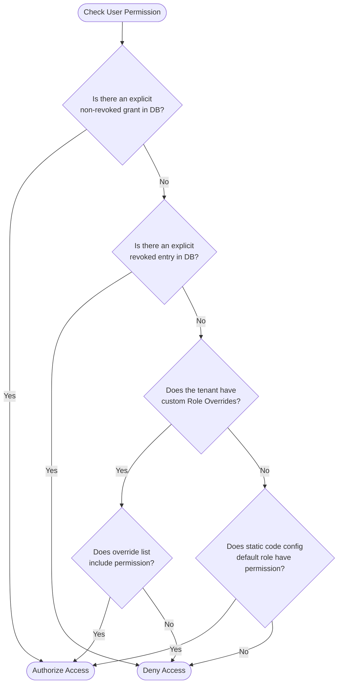
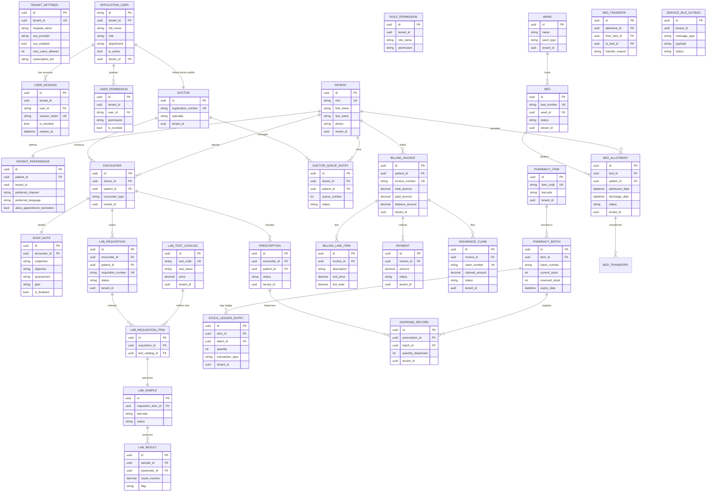

# 🏥 CareSphere — Multi-Tenant Hospital Management System (HMS)

CareSphere is a comprehensive, multi-tenant **Hospital Management System (HMS)** built with **Blazor Server** and **.NET 10**. Designed with modularity and extensibility in mind, it digitizes core clinical and administrative hospital operations — from patient onboarding and real-time bed tracking to clinical documentation (EMR), pharmacy inventory, lab report automation, billing, and automated patient engagement.

All processes run within a secure, multi-tenant isolated database model backed by Postgres, with SSO and third-party integrations (Supabase, Razorpay, Twilio, and Azure Service Bus).

---

## 📑 Table of Contents

1. [🛠️ Technology Stack & Integrations](#️-technology-stack--integrations)
2. [📂 Architecture & Key Patterns](#-architecture--key-patterns)
   - [Multi-Tenant Scoping](#multi-tenant-scoping)
   - [Service-Oriented Core](#service-oriented-core)
   - [Transactional Outbox Pattern](#transactional-outbox-pattern)
   - [Append-Only Auditing](#append-only-auditing)
3. [🔐 Authentication & RBAC (Authorization) Flow](#-authentication--rbac-authorization-flow)
   - [SSO & Token Verification](#sso--token-verification)
   - [Cached Permission Checks](#cached-permission-checks)
   - [Permission Hierarchy](#permission-hierarchy)
4. [🧩 System Modules ("How They Work")](#-system-modules-how-they-work)
   - [1. Patient Management](#1-patient-management)
   - [2. Ward & Bed Management](#2-ward--bed-management)
   - [3. Bed Allotment & Admission Workflows](#3-bed-allotment--admission-workflows)
   - [4. Doctor & EMR (Clinical) Workflow](#4-doctor--emr-clinical-workflow)
   - [5. Laboratory Management](#5-laboratory-management)
   - [6. Pharmacy & Inventory Management](#6-pharmacy--inventory-management)
   - [7. Billing, Payments & Claims](#7-billing-payments--claims)
   - [8. Notifications & Patient Engagement](#8-notifications--patient-engagement)
   - [9. Administration & Session Audits](#9-administration--session-audits)
5. [📊 Comprehensive Database Schema](#-comprehensive-database-schema)
6. [⚙️ Getting Started & Setup](#️-getting-started--setup)
7. [💡 Troubleshooting & Developer Guidelines](#-troubleshooting--developer-guidelines)

---

## 🛠️ Technology Stack & Integrations

CareSphere utilizes a modern enterprise .NET stack integrated with SaaS utilities for scale:

| Component | Technology | Purpose |
| :--- | :--- | :--- |
| **Framework** | .NET 10 (ASP.NET Core) | Core runtime environment |
| **UI Framework** | Blazor Server (Interactive Server Mode) | Server-rendered, real-time UI component framework |
| **Styling** | Bootstrap 5 + Bootstrap Icons | Sleek and responsive layout aesthetics |
| **Database ORM** | Entity Framework Core (EF Core) 9.0 | Database mapper & Migrations management |
| **Database** | PostgreSQL | Robust relational database |
| **SSO & Auth** | Supabase Auth + JWT Middleware | Cloud-hosted tenant user registration & token verification |
| **Payment Gateway**| Razorpay API | Direct patient invoice collection & receipt logs |
| **SMS/Video API** | Twilio API | Patient SMS notifications & doctor-patient teleconsultation sessions |
| **Message Broker** | Azure Service Bus | Asynchronous messaging queue for background processing |
| **PDF Generation** | QuestPDF | Clean community-licensed document generation (Invoices, Lab Reports) |

---

## 📂 Architecture & Key Patterns

CareSphere follows a clean, service-oriented structure designed to be easily debugged by developers. Below are the foundational architectural pillars:

### Multi-Tenant Scoping
The database is structured for logical multi-tenancy. Rather than having separate databases per customer, CareSphere uses a **Shared Database, Shared Schema** model where tables containing tenant data include a `tenant_id` column.
- **Service Layer Scoping:** Scoped database access is enforced manually in the service layer (e.g. by passing `Guid tenantId` to service methods or retrieving it from the active user's claims).
- **Security Warning:** Global EF Core query filters are *not* automatically configured on `ApplicationDbContext`. Developers must explicitly add `.Where(x => x.TenantId == tenantId)` to all queries to avoid leaking data between tenants.

### Service-Oriented Core
Interaction flow follows:
```
[Blazor Razor Component] ➔ [Service Interface (e.g., IBedService)] ➔ [Service Implementation (e.g., BedService)] ➔ [ApplicationDbContext] ➔ [PostgreSQL]
```
Services are registered as `Transient` or `Scoped` in [Program.cs](file:///d:/CareSphere/Program.cs) to prevent DB context sharing issues under concurrent Blazor Hub connections.

### Transactional Outbox Pattern
To guarantee asynchronous event delivery to external systems (such as notifying patients or updating external queues) without failing the primary database transaction, CareSphere uses a **Transactional Outbox**.
1. **Queueing:** When a critical operation occurs (e.g., admitting a patient, finalizing a lab report), the operation and the outgoing event are saved in the same DB transaction. A row is added to the `ServiceBusOutbox` table with `Status = "Pending"`.
2. **Immediate Dispatch:** The [ServiceBusService.cs](file:///d:/CareSphere/Services/ServiceBusService.cs) immediately attempts to enqueue the event onto the Azure Service Bus queue.
3. **Fallback Polling:** If the service bus connection is down or unconfigured, the transaction completes successfully, leaving the outbox item in `Pending` state.
4. **Background Processor:** [ServiceBusOutboxBackgroundService.cs](file:///d:/CareSphere/BackgroundServices/ServiceBusOutboxBackgroundService.cs) polls the database every 2 minutes and retries dispatching all `"Pending"` outbox messages.
5. **Consumer Pipeline:** [ServiceBusConsumerService.cs](file:///d:/CareSphere/BackgroundServices/ServiceBusConsumerService.cs) runs continuously to ingest incoming queue messages and delegate them to background processing services.

### Append-Only Auditing
To maintain security compliance, the `AuditEvents` table tracks actions across the system. It is configured to be append-only:
- Modification (`UPDATE`) or deletion (`DELETE`) on `AuditEvents` is restricted at the PostgreSQL level via Row-Level Security (RLS) policies.
- Database trigger scripts (see `migration_script.sql`) prevent editing this audit trail.

---

## 🔐 Authentication & RBAC (Authorization) Flow

### SSO & Token Verification
Users register and sign in through a federated middleware flow:
1. **SSO Providers:** External login options (Google, Microsoft Account, Generic OpenID Connect) are configured per tenant in `TenantSettings`.
2. **Supabase Auth Integration:** [SupabaseAuthService.cs](file:///d:/CareSphere/Infrastructure/SupabaseAuthService.cs) manages remote authentication tokens, while [SupabaseJwtMiddleware.cs](file:///d:/CareSphere/Infrastructure/SupabaseJwtMiddleware.cs) decodes inbound authorization tokens.
3. **Current User Context:** [CurrentUserHelper.cs](file:///d:/CareSphere/Infrastructure/CurrentUserHelper.cs) extracts claims from the current `ClaimsPrincipal` including the `TenantId`, roles, active `DoctorId` (if a practitioner), and explicit permissions.

### Cached Permission Checks
To support dynamic database-driven permissions without incurring the overhead of a database call on every component render or API route request:
- Permissions are cached using ASP.NET Core `IMemoryCache` (key format: `permission_{tenantId}_{userId}_{permission}`).
- Cache duration is set to **5 minutes** by default.
- When an admin grants or revokes a permission, the cache is instantly invalidated for that user using `InvalidateUserPermissionCache()` inside [PermissionService.cs](file:///d:/CareSphere/Services/PermissionService.cs).

### Permission Hierarchy
When `UserHasPermissionAsync()` is called by [PermissionAuthorizationHandler.cs](file:///d:/CareSphere/Authorization/PermissionAuthorizationHandler.cs), the system evaluates authorization in the following order:



---

## 🧩 System Modules ("How They Work")

### 1. Patient Management
*   **What it does:** Oversees the lifecycle of patient demographic files.
*   **Database Models:** `Patient`, `PatientPreference`
*   **Core Services:** [IPatientService](file:///d:/CareSphere/Services/IPatientService.cs) / [PatientService](file:///d:/CareSphere/Services/PatientService.cs)
*   **Business Rules & Workflow:**
    *   Creates a unique Medical Record Number (MRN) automatically using the format `MRN-YYYYMMDD-XXXX` (where `XXXX` is a random number).
    *   Maintains contact preferences for communication channels (SMS, WhatsApp, Email, Voice) and opt-out flags (e.g. appointment notifications, discharge alerts) in `PatientPreference`.
*   **Routes:** `/patients`, `/patients/create`, `/patients/{id}`, `/patients/edit/{id}`

### 2. Ward & Bed Management
*   **What it does:** Manages physical hospital structural capacity.
*   **Database Models:** `Ward`, `Bed`
*   **Core Services:** [IBedService](file:///d:/CareSphere/Services/IBedService.cs) / [BedService](file:///d:/CareSphere/Services/BedService.cs)
*   **Business Rules & Workflow:**
    *   Wards host beds and specify building location, floor, and specialty (General, ICU, Emergency, Private, Semi-Private).
    *   Beds are categorized by type (Standard, ICU, Isolation, Pediatric) and status (Available, Occupied, Maintenance, Reserved).
    *   **Validation Rule:** A ward cannot be deleted if it contains beds. A bed cannot be deleted if it has an active patient allotment.
*   **Routes:** `/wards`, `/wards/create`, `/beds`, `/beds/create`, `/beds/dashboard`

### 3. Bed Allotment & Admission Workflows
*   **What it does:** Handles clinical admission, internal transfers, and discharges.
*   **Database Models:** `BedAllotment`, `BedTransfer`
*   **Core Services:** [IBedService](file:///d:/CareSphere/Services/IBedService.cs) / [BedService](file:///d:/CareSphere/Services/BedService.cs)
*   **Business Rules & Workflow:**
    *   **Admission:** Associates a patient with a bed. The bed's status changes to `Occupied`. A patient can only have one active allotment.
    *   **Transfer:** Moves a patient to a different bed. Marks the old allotment as `Transferred` and updates the old bed to `Available`. It then creates a new `Active` allotment and sets the target bed to `Occupied`.
    *   **Discharge:** Marks the allotment as `Discharged` and frees the bed (`Available`). Enqueues a `DischargeNotification` to notify the patient.
*   **Routes:** `/allotments`, `/allotments/create`, `/allotments/transfer/{id}`

### 4. Doctor & EMR (Clinical) Workflow
*   **What it does:** Facilitates doctor consultations, queue tracking, EMR SOAP notes, prescribing, and teleconsultation.
*   **Database Models:** `Doctor`, `DoctorQueueEntry`, `Encounter`, `SoapNote`, `Prescription`, `DrugFormulary`, `DrugInteraction`, `TeleConsultSession`
*   **Core Services:** [IDoctorService](file:///d:/CareSphere/Services/IDoctorService.cs), [IQueueService](file:///d:/CareSphere/Services/IQueueService.cs), [IEncounterService](file:///d:/CareSphere/Services/IEncounterService.cs), [ISoapNoteService](file:///d:/CareSphere/Services/ISoapNoteService.cs), [IPrescriptionService](file:///d:/CareSphere/Services/IPrescriptionService.cs), [ITeleConsultService](file:///d:/CareSphere/Services/ITeleConsultService.cs), [IClinicalDecisionSupportService](file:///d:/CareSphere/Services/IClinicalDecisionSupportService.cs)
*   **Business Rules & Workflow:**
    *   Patients are checked into a queue (`DoctorQueueEntry`) for a specific practitioner.
    *   An `Encounter` is started (OPD, IPD, or Emergency).
    *   The doctor records clinical findings in a `SoapNote` (Subjective, Objective, Assessment, Plan). Once finalized, editing is disabled.
    *   **Clinical Decision Support (CDS):** When writing a `Prescription`, the service queries the `DrugInteractions` table. If the patient is prescribed two drugs with a documented conflict, the system blocks the order or raises a warning.
    *   **Telehealth:** Real-time consultations utilize [TeleConsultService](file:///d:/CareSphere/Services/TeleConsultService.cs) to initialize Twilio room credentials.
*   **Routes:** `/doctor/queue`, `/encounter/new`, `/encounter/view/{id}`

### 5. Laboratory Management
*   **What it does:** Handles lab catalogs, test ordering, sample tracking, and report generation.
*   **Database Models:** `LabTestCatalog`, `LabTestParameter`, `LabRequisition`, `LabRequisitionItem`, `LabSample`, `LabResult`, `LabReport`
*   **Core Services:** [ILabCatalogService](file:///d:/CareSphere/Services/ILabCatalogService.cs), [ILabRequisitionService](file:///d:/CareSphere/Services/ILabRequisitionService.cs), [ILabSampleService](file:///d:/CareSphere/Services/ILabSampleService.cs), [ILabResultService](file:///d:/CareSphere/Services/ILabResultService.cs), [ILabReportService](file:///d:/CareSphere/Services/ILabReportService.cs), [ILabNotificationService](file:///d:/CareSphere/Services/ILabNotificationService.cs)
*   **Business Rules & Workflow:**
    *   A doctor orders tests from the `LabTestCatalog` during an encounter, creating a `LabRequisition`.
    *   A lab technician collects specimen samples, registering a `LabSample` (status: Collected, Received, Rejected).
    *   **Reference Range Alerts:** On result input (`LabResult`), the system checks the numeric value against the test's `LabTestParameter` limits and automatically flags values as `High`, `Low`, or `Normal`.
    *   **PDF Compiler:** Verified results compile into a PDF via QuestPDF ([LabReportDocument.cs](file:///d:/CareSphere/Documents/LabReportDocument.cs)), and a `LabReportReady` message is sent to the Outbox.
*   **Routes:** `/laboratory/requisitions`, `/laboratory/catalog`, `/laboratory/results`

### 6. Pharmacy & Inventory Management
*   **What it does:** Tracks pharmacy stock, purchase flows, and medication dispensing.
*   **Database Models:** `Supplier`, `PharmacyItem`, `PharmacyBatch`, `PurchaseOrder`, `PurchaseOrderItem`, `GoodsReceivedNote`, `GrnItem`, `StockLedgerEntry`, `DispenseRecord`, `OtcSale`, `OtcSaleItem`, `ExpiryAlert`
*   **Core Services:** [IPharmacyItemService](file:///d:/CareSphere/Services/IPharmacyItemService.cs), [IPurchaseOrderService](file:///d:/CareSphere/Services/IPurchaseOrderService.cs), [IGrnService](file:///d:/CareSphere/Services/IGrnService.cs), [IStockLedgerService](file:///d:/CareSphere/Services/IStockLedgerService.cs), [IDispenseService](file:///d:/CareSphere/Services/IDispenseService.cs), [IOtcSaleService](file:///d:/CareSphere/Services/IOtcSaleService.cs), [IExpiryAlertService](file:///d:/CareSphere/Services/IExpiryAlertService.cs)
*   **Business Rules & Workflow:**
    *   **Purchase Cycle:** A Purchase Order (PO) is sent to a `Supplier`. Upon delivery, a Goods Received Note (GRN) is generated, adding batches to `PharmacyBatch` (tracking cost price, selling price, and expiration date).
    *   **Dispensing:** Pharmacy staff fulfill prescriptions. The system validates stock availability and decrements batch quantities, logging transaction details in the `StockLedgerEntry` audit.
    *   **Expiration Guard:** [ExpiryAlertBackgroundService.cs](file:///d:/CareSphere/BackgroundServices/ExpiryAlertBackgroundService.cs) checks for items expiring within 30/60/90 days and flags them in the `ExpiryAlerts` table.
*   **Routes:** `/pharmacy/items`, `/pharmacy/dispense`, `/pharmacy/po`, `/pharmacy/sales`

### 7. Billing, Payments & Claims
*   **What it does:** Manages financial ledgers, digital payments, and insurance claims.
*   **Database Models:** `BillingInvoice`, `BillingLineItem`, `Payment`, `InsuranceClaim`, `ClaimStatusHistory`, `InvoiceDocument`
*   **Core Services:** [IInvoiceService](file:///d:/CareSphere/Services/IInvoiceService.cs), [IPaymentService](file:///d:/CareSphere/Services/IPaymentService.cs), [IClaimService](file:///d:/CareSphere/Services/IClaimService.cs), [IDocumentService](file:///d:/CareSphere/Services/IDocumentService.cs)
*   **Business Rules & Workflow:**
    *   An invoice compiles charges (beds, lab fees, medication) as `BillingLineItem` rows.
    *   **Payment Collection:** Invoices can be paid online. The application initializes Razorpay orders via `RazorpayClientWrapper`. Upon confirmation, a `Payment` record is added, modifying the invoice's `paid_amount` and updating `balance_amount`.
    *   **Insurance Auditing:** Invoices associated with corporate insurance generate an `InsuranceClaim`. Claims track status history (Submitted, UnderReview, Approved, Rejected, Settled).
*   **Routes:** `/billing/invoices`, `/billing/invoice/{id}`, `/billing/claims`

### 8. Notifications & Patient Engagement
*   **What it does:** Automates patient-facing updates via SMS, email, or in-app templates.
*   **Database Models:** `NotificationTemplate`, `NotificationLog`, `AppointmentReminder`, `DischargeNotification`
*   **Core Services:** [INotificationTemplateService](file:///d:/CareSphere/Services/INotificationTemplateService.cs), [INotificationSenderService](file:///d:/CareSphere/Services/INotificationSenderService.cs), [IAppointmentReminderService](file:///d:/CareSphere/Services/IAppointmentReminderService.cs), [IDischargeNotificationService](file:///d:/CareSphere/Services/IDischargeNotificationService.cs)
*   **Business Rules & Workflow:**
    *   Maintains localization configurations by looking up templates in the database matching `TenantId`, `TemplateName`, `Channel`, and `Language` (default is `"en"`).
    *   **Reminders:** [AppointmentReminderBackgroundService.cs](file:///d:/CareSphere/BackgroundServices/AppointmentReminderBackgroundService.cs) scans for upcoming appointments, queues SMS/Email requests, and updates reminder logs.
    *   **Failure Recovery:** [NotificationRetryBackgroundService.cs](file:///d:/CareSphere/BackgroundServices/NotificationRetryBackgroundService.cs) runs every 30 minutes, querying `NotificationLogs` with `"Pending"` or `"Failed"` statuses, and retries delivery up to `max_retries` (default is 3).
*   **Routes:** `/admin/notifications`, `/admin/notifications/templates`

### 9. Administration & Session Audits
*   **What it does:** Configures multi-tenant parameters, permissions, and active device sessions.
*   **Database Models:** `ApplicationUser`, `UserPermission`, `RolePermission`, `TenantSettings`, `UserSession`
*   **Core Services:** [IPermissionService](file:///d:/CareSphere/Services/IPermissionService.cs), [IAuthService](file:///d:/CareSphere/Services/IAuthService.cs), [IUserService](file:///d:/CareSphere/Services/IUserService.cs), [ITenantService](file:///d:/CareSphere/Services/ITenantService.cs)
*   **Business Rules & Workflow:**
    *   Admins manage tenant settings (subscription tiers, maximum allowed users).
    *   **Active Session Auditing:** Active user sessions are tracked in `UserSession`. If a user's session is marked as `is_revoked = true` (e.g., from an administrative dashboard), the middleware logs the user out on their next action.
*   **Routes:** `/admin/users`, `/admin/roles`, `/admin/sessions`

---

## 📊 Comprehensive Database Schema

The database model structure is represented in the ER diagram below. Note that all entities (except system-wide tables like `Identity` schemas) are segregated using a `tenant_id` column for multi-tenancy.



---

## ⚙️ Getting Started & Setup

### Prerequisites
*   [.NET 10 SDK](https://dotnet.microsoft.com/download)
*   [PostgreSQL](https://www.postgresql.org/) (or access to a Supabase Postgres instance)
*   Visual Studio 2022 / VS Code

### 1. Configure Connection Strings
Update the database connection settings and API credentials in [appsettings.json](file:///d:/CareSphere/appsettings.json):
```json
{
  "ConnectionStrings": {
    "DefaultConnection": "Host=<host>;Port=5432;Database=caresphere_db;Username=<user>;Password=<password>"
  },
  "AzureServiceBus": {
    "ConnectionString": "<your-connection-string>",
    "QueueName": "caresphere-messages"
  },
  "Twilio": {
    "AccountSid": "<sid>",
    "AuthToken": "<token>",
    "PhoneNumber": "<phone>"
  },
  "Razorpay": {
    "KeyId": "<key-id>",
    "KeySecret": "<secret>"
  }
}
```

### 2. Apply EF Core Migrations
Execute the migrations from the command line to create the database tables:
```bash
dotnet ef database update
```

### 3. Build and Run the App
Launch the application:
```bash
dotnet run
```
Open your browser and navigate to the local server port printed in the terminal (typically `http://localhost:5000` or `https://localhost:5001`).

---

## 💡 Troubleshooting & Developer Guidelines

Before committing changes or troubleshooting system behavior, review the following guidelines:

### Database Seeding on Startup
On application initialization, the system uses [DatabaseSeeder.cs](file:///d:/CareSphere/Infrastructure/DatabaseSeeder.cs) to check if the database is seeded. If empty:
- It creates default system-wide roles (SuperAdmin, HospitalAdmin, Doctor, Pharmacist, LabTechnician, etc.).
- It sets up default permissions (`RolePermissionDefaults.cs`) and seeds a default SuperAdmin account.
- It inserts seed tenant configurations.
*To manually trigger database re-seeding during testing, drop the database and run `dotnet ef database update`.*

### Developing New Services (Multi-Tenant Isolation)
When creating a new database model or adding a query in the service layer:
*   Ensure the model includes a `TenantId` property if it holds tenant-specific records.
*   **Always** pass the `TenantId` from the current user principal (via `CurrentUserHelper`) to the query logic.
*   Filter queries explicitly:
    ```csharp
    var records = await _context.NewTable
                                .Where(x => x.TenantId == tenantId)
                                .ToListAsync();
    ```

### Simulating Azure Service Bus Offline (Outbox Verification)
To test the Transactional Outbox resilience:
1. Clear the `AzureServiceBus:ConnectionString` value in `appsettings.json`.
2. Perform a trigger action, like admitting a patient or completing a lab report.
3. Verify that a new entry appears in the `ServiceBusOutbox` table with `Status = "Pending"`.
4. Restore the connection string.
5. Wait up to 2 minutes for the background service to process the outbox, and verify that the status changes to `"Enqueued"` and the message is successfully published.

### Security and RBAC Middleware
If a page layout or endpoint denies access unexpectedly:
1. Check that the page includes the appropriate authorization attributes, such as:
   ```razor
   @attribute [Authorize(Policy = PolicyNames.Permission_Patients_View)]
   ```
2. Verify that your test user's role contains the required permission in `RolePermissionDefaults.cs` or has an explicit grant in the `UserPermissions` database table.
3. Clear the cache or wait 5 minutes for the memory cache to expire to verify permission updates.
