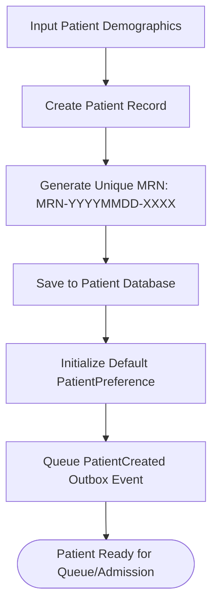
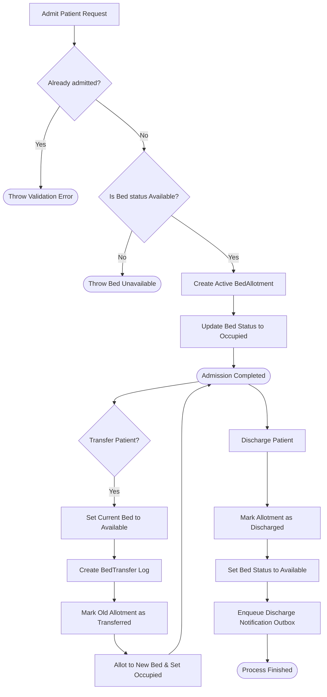
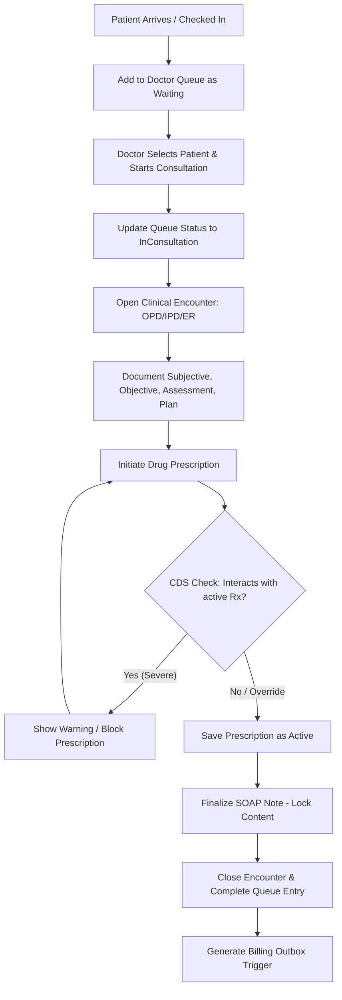
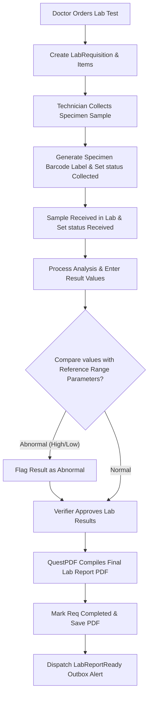
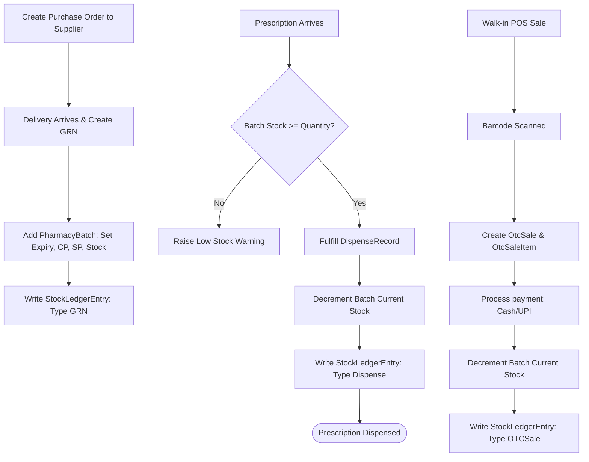
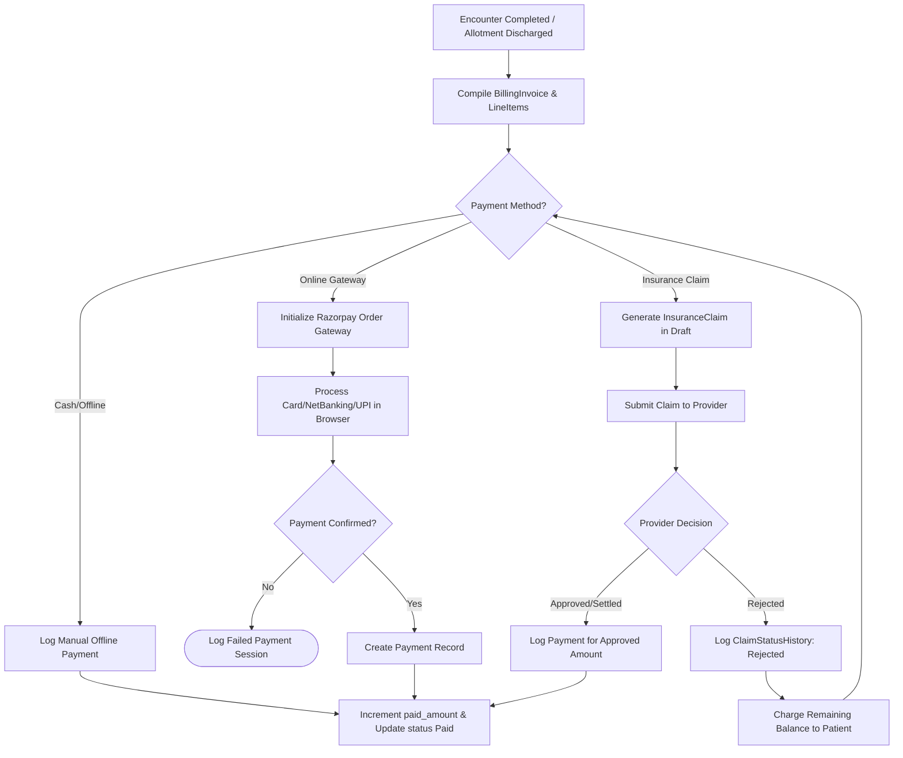

# 🏥 CareSphere — Multi-Tenant Hospital Management System (HMS)

CareSphere is a comprehensive, multi-tenant **Hospital Management System (HMS)** built with **Blazor Server** and **.NET 10**. Designed with modularity and extensibility in mind, it digitizes core clinical and administrative hospital operations — from patient onboarding and real-time bed tracking to clinical documentation (EMR), pharmacy inventory, lab report automation, billing, and automated patient engagement.

All processes run within a secure, multi-tenant isolated database model backed by Postgres, with SSO and third-party integrations (Supabase, Razorpay, Twilio, and Azure Service Bus).

---

## 📑 Table of Contents

1. [🛠️ Technology Stack & Integrations](#️-technology-stack--integrations)
2. [📂 Architecture & Key Patterns](#-architecture--key-patterns)
   - [Multi-Tenant Scoping](#multi-tenant-scoping)
   - [Service-Oriented Core](#service-oriented-core)
   - [Transactional Outbox Pattern](#transactional-outbox-pattern)
   - [Append-Only Auditing](#append-only-auditing)
3. [🔐 Authentication & RBAC (Authorization) Flow](#-authentication--rbac-authorization-flow)
   - [SSO & Token Verification](#sso--token-verification)
   - [Cached Permission Checks](#cached-permission-checks)
   - [Permission Hierarchy](#permission-hierarchy)
4. [👥 Role-Wise Landing Modules & Dashboards](#-role-wise-landing-modules--dashboards)
5. [🧩 System Modules & Detailed Workflows (with Flowcharts)](#-system-modules--detailed-workflows-with-flowcharts)
   - [1. Patient Management & Preferences](#1-patient-management--preferences)
   - [2. Ward, Bed & Allotment Workflows](#2-ward-bed--allotment-workflows)
   - [3. Doctor & EMR Clinical Workflows](#3-doctor--emr-clinical-workflows)
   - [4. Laboratory Management Lifecycle](#4-laboratory-management-lifecycle)
   - [5. Pharmacy & Inventory Management](#5-pharmacy--inventory-management)
   - [6. Billing, Payments & Claims](#6-billing-payments--claims)
   - [7. Notifications & Patient Engagement](#7-notifications--patient-engagement)
   - [8. Administration & Session Audits](#8-administration--session-audits)
6. [📊 Comprehensive Database Schema & Tables](#-comprehensive-database-schema--tables)
7. [⚙️ Getting Started & Setup](#️-getting-started--setup)
8. [💡 Troubleshooting & Developer Guidelines](#-troubleshooting--developer-guidelines)

---

## 🛠️ Technology Stack & Integrations

CareSphere utilizes a modern enterprise .NET stack integrated with SaaS utilities for scale:

| Component | Technology | Purpose |
| :--- | :--- | :--- |
| **Framework** | .NET 10 (ASP.NET Core) | Core runtime environment |
| **UI Framework** | Blazor Server (Interactive Server Mode) | Server-rendered, real-time UI component framework |
| **Styling** | Bootstrap 5 + Bootstrap Icons | Sleek and responsive layout aesthetics |
| **Database ORM** | Entity Framework Core (EF Core) 9.0 | Database mapper & Migrations management |
| **Database** | PostgreSQL | Robust relational database |
| **SSO & Auth** | Supabase Auth + JWT Middleware | Cloud-hosted tenant user registration & token verification |
| **Payment Gateway**| Razorpay API | Direct patient invoice collection & receipt logs |
| **SMS/Video API** | Twilio API | Patient SMS notifications & doctor-patient teleconsultation sessions |
| **Message Broker** | Azure Service Bus | Asynchronous messaging queue for background processing |
| **PDF Generation** | QuestPDF | Clean community-licensed document generation (Invoices, Lab Reports) |

---

## 📂 Architecture & Key Patterns

CareSphere follows a clean, service-oriented structure designed to be easily debugged by developers. Below are the foundational architectural pillars:

### Multi-Tenant Scoping
The database is structured for logical multi-tenancy. Rather than having separate databases per customer, CareSphere uses a **Shared Database, Shared Schema** model where tables containing tenant data include a `tenant_id` column.
- **Service Layer Scoping:** Scoped database access is enforced manually in the service layer (e.g. by passing `Guid tenantId` to service methods or retrieving it from the active user's claims).
- **Global Query Filters:** Automatic tenant-level data isolation is configured in [ApplicationDbContext.cs](file:///d:/CareSphere/Data/ApplicationDbContext.cs) using EF Core query filters. On database queries, records are automatically restricted to the active tenant session: `.HasQueryFilter(x => x.TenantId == _tenantContext.TenantId)`.

### Service-Oriented Core
Interaction flow follows:
```
[Blazor Razor Component] ➔ [Service Interface (e.g., IBedService)] ➔ [Service Implementation (e.g., BedService)] ➔ [ApplicationDbContext] ➔ [PostgreSQL]
```
Services are registered as `Transient` or `Scoped` in [Program.cs](file:///d:/CareSphere/Program.cs) to prevent DB context sharing issues under concurrent Blazor Hub connections.

### Transactional Outbox Pattern
To guarantee asynchronous event delivery to external systems (such as notifying patients or updating external queues) without failing the primary database transaction, CareSphere uses a **Transactional Outbox**.
1. **Queueing:** When a critical operation occurs (e.g., admitting a patient, finalizing a lab report), the operation and the outgoing event are saved in the same DB transaction. A row is added to the `ServiceBusOutbox` table with `Status = "Pending"`.
2. **Immediate Dispatch:** The [ServiceBusService.cs](file:///d:/CareSphere/Modules/Shared/Services/ServiceBusService.cs) immediately attempts to enqueue the event onto the Azure Service Bus queue.
3. **Fallback Polling:** If the service bus connection is down or unconfigured, the transaction completes successfully, leaving the outbox item in `Pending` state.
4. **Background Processor:** [ServiceBusOutboxBackgroundService.cs](file:///d:/CareSphere/BackgroundServices/ServiceBusOutboxBackgroundService.cs) polls the database every 2 minutes and retries dispatching all `"Pending"` outbox messages.
5. **Consumer Pipeline:** [ServiceBusConsumerService.cs](file:///d:/CareSphere/BackgroundServices/ServiceBusConsumerService.cs) runs continuously to ingest incoming queue messages and delegate them to background processing services.

### Append-Only Auditing
To maintain security compliance, the `AuditEvents` table tracks actions across the system. It is configured to be append-only:
- Modification (`UPDATE`) or deletion (`DELETE`) on `AuditEvents` is restricted at the PostgreSQL level via Row-Level Security (RLS) policies.
- Database trigger scripts (see `migration_script.sql`) prevent editing this audit trail.

### Modular Isolation & Boundaries
CareSphere is organized into distinct domain-driven sub-modules under the [Modules/](file:///d:/CareSphere/Modules) directory (e.g., `Admin`, `Billing`, `Clinical`, `Laboratory`, `Notifications`, `Patients`, `Pharmacy`, `Shared`, `Ward`). To maintain clean architectural boundaries and prevent tight coupling:
- **No Cross-Module Constructor Injection:** Services in one module cannot directly inject services from other modules. Communication across modules must be mediated via shared events, read models, or interfaces defined in the [Shared](file:///d:/CareSphere/Modules/Shared) module.
- **Isolated Layout & Navigation:** Each module defines its own page layouts (e.g., `PatientsLayout.razor`, `PharmacyLayout.razor`). Navigation links from one module cannot leak into the layouts of other modules.
- **Automated Validation:** These constraints are programmatically enforced via architectural unit tests:
  - [ModuleBoundaryTests.cs](file:///d:/CareSphere/Tests/ModuleBoundaryTests.cs): Verifies that no forbidden cross-module service dependencies are injected via constructor.
  - [ModuleNavigationIsolationTests.cs](file:///d:/CareSphere/Tests/ModuleNavigationIsolationTests.cs): Ensures layout markup files do not contain forbidden navigation hrefs to other modules.

---

## 🔐 Authentication & RBAC (Authorization) Flow

### SSO & Token Verification
Users register and sign in through a federated middleware flow:
1. **SSO Providers:** External login options (Google, Microsoft Account, Generic OpenID Connect) are configured per tenant in `TenantSettings`.
2. **Supabase Auth Integration:** [SupabaseAuthService.cs](file:///d:/CareSphere/Infrastructure/SupabaseAuthService.cs) manages remote authentication tokens, while [SupabaseJwtMiddleware.cs](file:///d:/CareSphere/Infrastructure/SupabaseJwtMiddleware.cs) decodes inbound authorization tokens.
3. **Current User Context:** [CurrentUserHelper.cs](file:///d:/CareSphere/Infrastructure/CurrentUserHelper.cs) extracts claims from the current `ClaimsPrincipal` including the `TenantId`, roles, active `DoctorId` (if a practitioner), and explicit permissions.
4. **Tab-Isolated Authentication:** Blazor Interactive Server mode is wired to [TabIsolatedAuthenticationStateProvider.cs](file:///d:/CareSphere/Authorization/TabIsolatedAuthenticationStateProvider.cs). The active session token is read from `window.name` (ensuring tab isolation and surviving F5 refresh), which then seeds the scoped user principal and enforces tenant query filters.

### Cached Permission Checks
To support dynamic database-driven permissions without incurring the overhead of a database call on every component render or API route request:
- Permissions are cached using ASP.NET Core `IMemoryCache` (key format: `permission_{tenantId}_{userId}_{permission}`).
- Cache duration is set to **5 minutes** by default.
- When an admin grants or revokes a permission, the cache is instantly invalidated for that user using `InvalidateUserPermissionCache()` inside [PermissionService.cs](file:///d:/CareSphere/Modules/Admin/Services/PermissionService.cs).

### Permission Hierarchy
When `UserHasPermissionAsync()` is called by [PermissionAuthorizationHandler.cs](file:///d:/CareSphere/Authorization/PermissionAuthorizationHandler.cs), the system evaluates authorization in the following order:


---

## 👥 Role-Wise Landing Modules & Dashboards

Upon successful login, the application middleware in [Home.razor](file:///d:/CareSphere/Components/Pages/Home.razor) intercepts the user session and routes them to their specific role-based landing dashboard.

| User Role | Landing Route | Dashboard Component | Key Metrics & Widgets | Primary Operational Actions |
| :--- | :--- | :--- | :--- | :--- |
| **SuperAdmin / HospitalAdmin** | `/admin/dashboard` | `AdminDashboard.razor` | <ul><li>Total & Active Users</li><li>Total Patients & Active Sessions</li><li>Total & Available Beds</li><li>Recent Logins & Audit Logs</li></ul> | <ul><li>User creation & editing</li><li>Role permission configuration</li><li>System settings management</li><li>Active session revocation</li></ul> |
| **Doctor** | `/doctor/queue/{DoctorId}` | `Index.razor` (Modules/Clinical) | <ul><li>Active Patient Queue list</li><li>Consultation statuses</li><li>Estimated wait times</li></ul> | <ul><li>Add patient to waitlist queue</li><li>Start consultations (Encounter)</li><li>Write & finalize SOAP Notes</li><li>CDS conflict check & prescribing</li></ul> |
| **Nurse** | `/beds/dashboard` | `Dashboard.razor` (Modules/Ward) | <ul><li>Total & Occupied Beds</li><li>Ward Occupancy Breakdown</li><li>Maintenance status counters</li></ul> | <ul><li>Patient bed admission</li><li>Allotment tracking</li><li>Transfer patients between beds</li><li>Perform patient discharge</li></ul> |
| **Receptionist** | `/patients` | `Index.razor` (Modules/Patients) | <ul><li>Patient demographic registers</li><li>Search filter by MRN/Name</li></ul> | <ul><li>Register new patient profile</li><li>Initialize patient preferences</li><li>Edit patient profiles</li><li>Check-in patient to doctor queue</li></ul> |
| **Pharmacist** | `/pharmacy/dashboard` | `Dashboard.razor` (Modules/Pharmacy) | <ul><li>Catalog items count</li><li>Low Stock Reorder Alerts</li><li>Near Expiry Batches (90d)</li><li>Today's OTC Sales Revenue</li></ul> | <ul><li>Dispense active prescriptions</li><li>Point of Sale (OTC POS) sales</li><li>Purchase Orders & GRN receipts</li><li>Manage supplier directories</li></ul> |
| **Lab Technician** | `/lab/dashboard` | `Dashboard.razor` (Modules/Laboratory) | <ul><li>Today's Tests Ordered</li><li>Pending Sample Collections</li><li>In-Process Lab requisitions</li><li>Abnormal results alerts</li></ul> | <ul><li>View requisitions</li><li>Log sample collection (barcoding)</li><li>Enter numeric/text results</li><li>Verify results & compile PDF reports</li></ul> |
| **Billing Staff** | `/billing/dashboard` | `Dashboard.razor` (Modules/Billing) | <ul><li>Today's Invoiced Amount</li><li>Online/Offline Collected Payments</li><li>Pending Insurance Claims</li></ul> | <ul><li>Compile invoices & line items</li><li>Generate online Razorpay payment links</li><li>Log Cash/Offline payments</li><li>Process insurance claim cycles</li></ul> |

---

## 🧩 System Modules & Detailed Workflows (with Flowcharts)

### 1. Patient Management & Preferences
*   **What it does:** Manages patient onboarding files and communication settings.
*   **Core Services:** [PatientService](file:///d:/CareSphere/Modules/Patients/Services/PatientService.cs)
*   **Business Flow:** 
    1. A receptionist adds a patient in `/patients/create`.
    2. The service automatically calculates and generates a unique **Medical Record Number (MRN)** with format `MRN-YYYYMMDD-XXXX`.
    3. The system inserts standard communication choices (`PatientPreference`), tracking customer consents for SMS, Email, WhatsApp, or Voice, and specific triggers (e.g. reminding for appointments, notifying on discharge, or sharing lab results).
*   **Workflow Diagram:**



---

### 2. Ward, Bed & Allotment Workflows
*   **What it does:** Oversees physical ward structures, bed capacities, and real-time patient room allocations.
*   **Core Services:** [BedService](file:///d:/CareSphere/Modules/Ward/Services/BedService.cs)
*   **Business Rules:**
    *   **Admission:** Associates a patient with a bed. The bed status is updated to `Occupied`, and a `BedAllotment` is set to `Active`. Only one active allotment is allowed per patient.
    *   **Transfer:** Moves a patient to another bed. The original allotment status is changed to `Transferred`, the old bed status is reset to `Available`, a `BedTransfer` log is generated, and the new bed is marked `Occupied` under a new active allotment.
    *   **Discharge:** Marks the allotment as `Discharged`, marks the bed `Available`, and registers a background task in `DischargeNotifications` to alert the patient.
*   **Workflow Diagram:**



---

### 3. Doctor & EMR Clinical Workflows
*   **What it does:** Orchestrates patient waitlists, consultations (Encounters), SOAP medical note entries, CDS-assisted prescribing, and teleconsultation sessions.
*   **Core Services:** [QueueService](file:///d:/CareSphere/Modules/Clinical/Services/IQueueService.cs), [EncounterService](file:///d:/CareSphere/Modules/Clinical/Services/IEncounterService.cs), [SoapNoteService](file:///d:/CareSphere/Modules/Clinical/Services/ISoapNoteService.cs), [PrescriptionService](file:///d:/CareSphere/Modules/Clinical/Services/IPrescriptionService.cs), [ClinicalDecisionSupportService](file:///d:/CareSphere/Modules/Clinical/Services/IClinicalDecisionSupportService.cs)
*   **Business Rules:**
    *   **Queueing:** Patients are checked into `DoctorQueueEntries` (status: `Waiting`). The doctor changes this to `InConsultation` to begin the session.
    *   **SOAP Documentation:** Clinical observations are documented in a `SoapNote`. Finalizing a SOAP note locks it from future editing.
    *   **CDS Prescribing Check:** When writing a prescription, the CDS engine checks the `DrugInteractions` catalog. If the candidate drug interacts with any of the patient's existing active medications, a clinical warning blocks or flags the transaction.
*   **Workflow Diagram:**



---

### 4. Laboratory Management Lifecycle
*   **What it does:** Manages test catalogs, specimen collection tracking, value analysis, and PDF reports.
*   **Core Services:** [ILabRequisitionService](file:///d:/CareSphere/Modules/Laboratory/Services/ILabRequisitionService.cs), [ILabSampleService](file:///d:/CareSphere/Modules/Laboratory/Services/ILabSampleService.cs), [ILabResultService](file:///d:/CareSphere/Modules/Laboratory/Services/ILabResultService.cs), [ILabReportService](file:///d:/CareSphere/Modules/Laboratory/Services/ILabReportService.cs)
*   **Business Rules:**
    *   **Specimen Collection:** The lab technician collects samples and updates status to `Collected`, generating a unique barcode tracking label.
    *   **Reference Ranges:** Entered results are validated against `LabTestParameters`. Values outside low/high thresholds are flagged `High`/`Low` automatically.
    *   **Report Generation:** Verified reports are compiled into a PDF via QuestPDF and saved to storage. An outbox event alerts the doctor.
*   **Workflow Diagram:**



---

### 5. Pharmacy & Inventory Management
*   **What it does:** Oversees supplier workflows, batch tracking, expiry monitoring, OTC sales, and prescription dispensing.
*   **Core Services:** [IPharmacyItemService](file:///d:/CareSphere/Modules/Pharmacy/Services/IPharmacyItemService.cs), [IPurchaseOrderService](file:///d:/CareSphere/Modules/Pharmacy/Services/IPurchaseOrderService.cs), [IGrnService](file:///d:/CareSphere/Modules/Pharmacy/Services/IGrnService.cs), [IDispenseService](file:///d:/CareSphere/Modules/Pharmacy/Services/IDispenseService.cs), [IOtcSaleService](file:///d:/CareSphere/Modules/Pharmacy/Services/IOtcSaleService.cs)
*   **Business Rules:**
    *   **Stock Inward:** Items are added to the catalog and linked to a `Supplier`. Upon receiving a PO delivery, a Goods Received Note (GRN) adds the items to a specific `PharmacyBatch` (with custom expiry, unit pricing, and code).
    *   **Expiry Guard:** The `ExpiryAlertBackgroundService` runs daily, scanning batches. If a batch is within 90 days of expiry, it logs an alert to notify staff.
    *   **Dispensing & Ledger:** Fulfilling a prescription requires checking stock availability. Dispensing decrements the batch stock and creates a `StockLedgerEntry` audit trail.
*   **Workflow Diagram:**



---

### 6. Billing, Payments & Claims
*   **What it does:** Compiles healthcare costs, processes online payment gateways, and manages insurance claims.
*   **Core Services:** [IInvoiceService](file:///d:/CareSphere/Modules/Billing/Services/IInvoiceService.cs), [IPaymentService](file:///d:/CareSphere/Modules/Billing/Services/IPaymentService.cs), [IClaimService](file:///d:/CareSphere/Modules/Billing/Services/IClaimService.cs)
*   **Business Rules:**
    *   **Invoice Creation:** Service costs (lab tests, bed allotment days, and dispensed drugs) are added as `BillingLineItems`.
    *   **Balance Computations:** Invoice balance amounts are computed automatically in the database: `balance_amount = total_amount - paid_amount`.
    *   **Insurance Flow:** Invoices marked for corporate coverage generate an `InsuranceClaim`. The claim lifecycle tracks statuses (Draft, Submitted, UnderReview, Approved, Settled, Rejected).
*   **Workflow Diagram:**



---

### 7. Notifications & Patient Engagement
*   **What it does:** Manages patient-facing communication workflows using localized templates.
*   **Core Services:** [INotificationTemplateService](file:///d:/CareSphere/Modules/Notifications/Services/INotificationTemplateService.cs), [INotificationSenderService](file:///d:/CareSphere/Modules/Notifications/Services/INotificationSenderService.cs), [IAppointmentReminderService](file:///d:/CareSphere/Modules/Notifications/Services/IAppointmentReminderService.cs)
*   **Business Rules:**
    *   **Reminders:** `AppointmentReminderBackgroundService` checks for upcoming appointments, queues SMS/Email requests, and updates reminder logs.
    *   **Failure Recovery:** `NotificationRetryBackgroundService` runs periodically, checking for `Failed` or `Pending` notification logs and retrying delivery up to 3 times.

---

### 8. Administration & Session Audits
*   **What it does:** Oversees administrative controls, subscription parameters, and active user session monitoring.
*   **Core Services:** [IUserService](file:///d:/CareSphere/Modules/Admin/Services/IUserService.cs), [IPermissionService](file:///d:/CareSphere/Modules/Admin/Services/IPermissionService.cs), [IImpersonationService](file:///d:/CareSphere/Modules/Admin/Services/ImpersonationService.cs)
*   **Business Rules:**
    *   **Session Revocation:** Active sessions are logged in `UserSessions`. Admin revocation instantly invalidates the session token, logging the target user out.

---

## 📊 Comprehensive Database Schema & Tables

CareSphere database entities are logically separated by tenant using `tenant_id` filters, managed dynamically by the EF Core context.

```mermaid
erDiagram
    TENANT_SETTINGS {
        uuid id PK
        uuid tenant_id UK
        string hospital_name
        string city
        string state
        string pin_code
        string email
        string phone
        bool is_active
        string subscription_tier
        int max_users_allowed
    }
    APPLICATION_USER {
        string id PK
        uuid tenant_id FK
        string full_name
        string role
        bool is_active
        uuid doctor_id FK
    }
    USER_SESSION {
        uuid id PK
        uuid tenant_id
        string user_id FK
        string session_token UK
        bool is_revoked
        datetime expires_at
    }
    USER_PERMISSION {
        uuid id PK
        uuid tenant_id
        string user_id FK
        string permission
        bool is_revoked
    }
    ROLE_PERMISSION {
        uuid id PK
        uuid tenant_id
        string role_name
        string permission
    }
    PATIENT {
        uuid id PK
        string mrn UK
        string first_name
        string last_name
        string phone
        string email
        string address
        string blood_group
        uuid tenant_id
    }
    PATIENT_PREFERENCE {
        uuid id PK
        uuid patient_id FK
        uuid tenant_id
        string preferred_channel
        string preferred_language
        bool allow_appointment_reminders
        bool allow_discharge_notifications
        bool allow_lab_notifications
    }
    WARD {
        uuid id PK
        string name
        string ward_type
        string floor
        string building
        uuid tenant_id
    }
    BED {
        uuid id PK
        string bed_number UK
        uuid ward_id FK
        string bed_type
        string status
        bool is_active
        uuid tenant_id
    }
    BED_ALLOTMENT {
        uuid id PK
        uuid bed_id FK
        uuid patient_id FK
        datetime admission_date
        datetime discharge_date
        string admission_type
        string admitting_doctor
        string notes
        string status
        uuid tenant_id
    }
    BED_TRANSFER {
        uuid id PK
        uuid allotment_id FK
        uuid from_bed_id FK
        uuid to_bed_id FK
        string transfer_reason
        datetime transferred_at
        uuid tenant_id
    }
    DOCTOR {
        uuid id PK
        string first_name
        string last_name
        string specialty
        string registration_number UK
        string phone
        string email
        bool is_active
        uuid tenant_id
    }
    DOCTOR_QUEUE_ENTRY {
        uuid id PK
        uuid doctor_id FK
        uuid patient_id FK
        int queue_position
        string status
        int estimated_wait_minutes
        datetime checked_in_at
        uuid tenant_id
    }
    ENCOUNTER {
        uuid id PK
        uuid doctor_id FK
        uuid patient_id FK
        string encounter_type
        string status
        datetime admission_date
        string chief_complaint
        uuid tenant_id
    }
    SOAP_NOTE {
        uuid id PK
        uuid encounter_id FK
        string subjective
        string objective
        string assessment
        string plan
        string status
        uuid created_by_doctor_id FK
        uuid tenant_id
    }
    PRESCRIPTION {
        uuid id PK
        uuid encounter_id FK
        uuid patient_id FK
        uuid doctor_id FK
        string drug_name
        string drug_code
        string form
        string strength
        string frequency
        string duration
        string route
        int quantity
        string status
        datetime issued_at
        uuid tenant_id
    }
    DRUG_FORMULARY {
        uuid id PK
        string drug_code UK
        string generic_name
        string brand_name
        string form
        string strength
        string unit
        bool is_controlled
        bool is_active
        uuid tenant_id
    }
    TELE_CONSULT_SESSION {
        uuid id PK
        uuid encounter_id FK
        uuid doctor_id FK
        uuid patient_id FK
        string session_type
        string status
        string meeting_link
        int duration_minutes
        uuid tenant_id
    }
    DRUG_INTERACTION {
        uuid id PK
        string drug_code_a
        string drug_code_b
        string severity
        string description
        uuid tenant_id
    }
    AUDIT_EVENT {
        uuid id PK
        string user_id FK
        string action
        string resource_type
        uuid resource_id
        string ip_address
        string device
        datetime timestamp
        string details
        uuid tenant_id
    }
    BILLING_INVOICE {
        uuid id PK
        uuid patient_id FK
        uuid encounter_id FK
        string invoice_number UK
        datetime invoice_date
        datetime due_date
        decimal subtotal_amount
        decimal discount_amount
        decimal tax_amount
        decimal total_amount
        decimal paid_amount
        decimal balance_amount
        string status
        string generated_by_user_id FK
        uuid tenant_id
    }
    BILLING_LINE_ITEM {
        uuid id PK
        uuid invoice_id FK
        string item_type
        string item_description
        string item_code
        decimal quantity
        decimal unit_price
        decimal discount_percent
        decimal tax_percent
        decimal line_total
        uuid tenant_id
    }
    PAYMENT {
        uuid id PK
        uuid invoice_id FK
        uuid patient_id FK
        datetime payment_date
        decimal amount
        string payment_method
        string status
        string recorded_by_user_id FK
        uuid tenant_id
    }
    INSURANCE_CLAIM {
        uuid id PK
        uuid invoice_id FK
        uuid patient_id FK
        uuid encounter_id FK
        string claim_number UK
        string insurance_provider
        string policy_number
        string member_name
        decimal claimed_amount
        decimal approved_amount
        decimal rejected_amount
        string status
        uuid tenant_id
    }
    CLAIM_STATUS_HISTORY {
        uuid id PK
        uuid claim_id FK
        string previous_status
        string new_status
        datetime changed_at
        string changed_by_user_id FK
        string remarks
        uuid tenant_id
    }
    INVOICE_DOCUMENT {
        uuid id PK
        uuid invoice_id FK
        string document_type
        string storage_path
        string file_name
        datetime generated_at
        int file_size_bytes
        bool is_latest
        uuid tenant_id
    }
    SUPPLIER {
        uuid id PK
        string supplier_name
        string contact_person
        string phone
        string email
        string address
        string gst_number
        string license_number
        bool is_active
        uuid tenant_id
    }
    PHARMACY_ITEM {
        uuid id PK
        string item_code UK
        string item_name
        string generic_name
        string category
        string form
        string strength
        string unit
        string barcode UK
        bool is_controlled
        bool requires_prescription
        int reorder_level
        bool is_active
        uuid tenant_id
    }
    PHARMACY_BATCH {
        uuid id PK
        uuid item_id FK
        string batch_number
        uuid supplier_id FK
        datetime manufacture_date
        datetime expiry_date
        decimal purchase_price
        decimal selling_price
        int current_stock
        int reserved_stock
        int available_stock
        bool is_active
        uuid tenant_id
    }
    PURCHASE_ORDER {
        uuid id PK
        string po_number UK
        uuid supplier_id FK
        datetime order_date
        datetime expected_delivery_date
        string status
        decimal total_amount
        string created_by_user_id FK
        uuid tenant_id
    }
    PURCHASE_ORDER_ITEM {
        uuid id PK
        uuid po_id FK
        uuid item_id FK
        int requested_quantity
        int received_quantity
        decimal unit_price
        decimal total_price
        uuid tenant_id
    }
    GOODS_RECEIVED_NOTE {
        uuid id PK
        string grn_number UK
        uuid po_id FK
        uuid supplier_id FK
        datetime received_date
        string invoice_number
        decimal total_amount
        string status
        string received_by_user_id FK
        uuid tenant_id
    }
    GRN_ITEM {
        uuid id PK
        uuid grn_id FK
        uuid item_id FK
        string batch_number
        datetime manufacture_date
        datetime expiry_date
        int received_quantity
        int free_quantity
        decimal purchase_price
        decimal selling_price
        decimal total_amount
        uuid batch_id FK
        uuid tenant_id
    }
    STOCK_LEDGER_ENTRY {
        uuid id PK
        uuid item_id FK
        uuid batch_id FK
        string transaction_type
        string reference_id
        string reference_type
        int quantity_in
        int quantity_out
        int balance_after
        datetime transaction_date
        string created_by_user_id FK
        uuid tenant_id
    }
    DISPENSE_RECORD {
        uuid id PK
        uuid prescription_id FK
        uuid patient_id FK
        uuid item_id FK
        uuid batch_id FK
        int dispensed_quantity
        datetime dispensed_at
        string dispensed_by_user_id FK
        string barcode_scanned
        uuid tenant_id
    }
    OTC_SALE {
        uuid id PK
        string sale_number UK
        datetime sale_date
        string customer_name
        string customer_phone
        decimal total_amount
        string payment_method
        string payment_status
        string created_by_user_id FK
        uuid tenant_id
    }
    OTC_SALE_ITEM {
        uuid id PK
        uuid sale_id FK
        uuid item_id FK
        uuid batch_id FK
        string barcode_scanned
        int quantity
        decimal unit_price
        decimal total_price
        uuid tenant_id
    }
    EXPIRY_ALERT {
        uuid id PK
        uuid batch_id FK
        uuid item_id FK
        datetime expiry_date
        int days_until_expiry
        string alert_type
        datetime sent_at
        bool is_acknowledged
        uuid tenant_id
    }
    LAB_TEST_CATALOG {
        uuid id PK
        string test_code UK
        string test_name
        string category
        string sample_type
        int turnaround_hours
        decimal price
        bool is_active
        uuid tenant_id
    }
    LAB_TEST_PARAMETER {
        uuid id PK
        uuid test_id FK
        string parameter_name
        string parameter_code
        string unit
        decimal reference_range_low
        decimal reference_range_high
        string data_type
        uuid tenant_id
    }
    LAB_REQUISITION {
        uuid id PK
        string requisition_number UK
        uuid patient_id FK
        uuid encounter_id FK
        uuid ordered_by_doctor_id FK
        datetime ordered_at
        string priority
        string status
        uuid tenant_id
    }
    LAB_REQUISITION_ITEM {
        uuid id PK
        uuid requisition_id FK
        uuid test_id FK
        string status
        uuid tenant_id
    }
    LAB_SAMPLE {
        uuid id PK
        uuid requisition_id FK
        string sample_type
        datetime collected_at
        string collected_by_user_id FK
        string barcode_label
        bool is_received
        datetime received_at
        string received_by_user_id FK
        uuid tenant_id
    }
    LAB_RESULT {
        uuid id PK
        uuid requisition_item_id FK
        uuid parameter_id FK
        string result_value
        decimal result_numeric
        string result_unit
        decimal reference_range_low
        decimal reference_range_high
        bool is_abnormal
        string entered_by_user_id FK
        datetime entered_at
        string verified_by_user_id FK
        datetime verified_at
        uuid tenant_id
    }
    LAB_REPORT {
        uuid id PK
        uuid requisition_id FK
        datetime generated_at
        string generated_by_user_id FK
        string storage_path
        string file_name
        bool is_latest
        bool in_app_notification_sent
        uuid tenant_id
    }
    IN_APP_NOTIFICATION {
        uuid id PK
        string recipient_type
        string recipient_id
        string title
        string message
        string resource_type
        string resource_id
        bool is_read
        datetime created_at
        uuid tenant_id
    }
    NOTIFICATION_TEMPLATE {
        uuid id PK
        string template_name
        string notification_type
        string channel
        string language
        string template_body
        bool is_active
        uuid tenant_id
    }
    NOTIFICATION_LOG {
        uuid id PK
        uuid patient_id FK
        string recipient_phone
        string recipient_name
        string channel
        string notification_type
        string language
        string message_body
        string status
        datetime sent_at
        int retry_count
        int max_retries
        uuid tenant_id
    }
    APPOINTMENT_REMINDER {
        uuid id PK
        uuid patient_id FK
        uuid doctor_id FK
        datetime appointment_date
        string reminder_type
        string channel
        string language
        string status
        datetime scheduled_at
        uuid notification_log_id FK
        uuid tenant_id
    }
    DISCHARGE_NOTIFICATION {
        uuid id PK
        uuid allotment_id FK
        uuid patient_id FK
        datetime discharged_at
        string channel
        string language
        string status
        uuid notification_log_id FK
        uuid tenant_id
    }
    SERVICE_BUS_OUTBOX {
        uuid id PK
        string message_type
        string payload
        string status
        datetime created_at
        uuid tenant_id
    }

    APPLICATION_USER ||--o{ USER_SESSION : "has sessions"
    APPLICATION_USER ||--o{ USER_PERMISSION : "granted"
    APPLICATION_USER ||--|| DOCTOR : "linked doctor profile"
    PATIENT ||--|| PATIENT_PREFERENCE : "defines"
    WARD ||--o{ BED : "hosts"
    BED ||--o{ BED_ALLOTMENT : "allotted"
    PATIENT ||--o{ BED_ALLOTMENT : "admitted"
    BED_ALLOTMENT ||--o{ BED_TRANSFER : "transferred"
    DOCTOR ||--o{ DOCTOR_QUEUE_ENTRY : "manages"
    PATIENT ||--o{ DOCTOR_QUEUE_ENTRY : "joins"
    DOCTOR ||--o{ ENCOUNTER : "conducts"
    PATIENT ||--o{ ENCOUNTER : "attends"
    ENCOUNTER ||--|| SOAP_NOTE : "details"
    ENCOUNTER ||--o{ PRESCRIPTION : "includes"
    ENCOUNTER ||--o{ LAB_REQUISITION : "orders"
    LAB_REQUISITION ||--o{ LAB_REQUISITION_ITEM : "contains"
    LAB_TEST_CATALOG ||--o{ LAB_REQUISITION_ITEM : "defines test"
    LAB_REQUISITION_ITEM ||--|| LAB_SAMPLE : "specimen"
    LAB_SAMPLE ||--o{ LAB_RESULT : "produces"
    PATIENT ||--o{ BILLING_INVOICE : "billed"
    BILLING_INVOICE ||--o{ BILLING_LINE_ITEM : "lists"
    BILLING_INVOICE ||--o{ PAYMENT : "collects"
    BILLING_INVOICE ||--o{ INSURANCE_CLAIM : "files"
    PHARMACY_ITEM ||--o{ PHARMACY_BATCH : "stocked in"
    PHARMACY_BATCH ||--o{ STOCK_LEDGER_ENTRY : "logs ledger"
    PRESCRIPTION ||--o{ DISPENSE_RECORD : "dispenses"
    PHARMACY_BATCH ||--o{ DISPENSE_RECORD : "supplies"
```



---

## ⚙️ Getting Started & Setup

### Prerequisites
*   [.NET 10 SDK](https://dotnet.microsoft.com/download)
*   [PostgreSQL](https://www.postgresql.org/) (or access to a Supabase Postgres instance)
*   Visual Studio 2022 / VS Code

### 1. Configure Connection Strings
Update the database connection settings and API credentials in [appsettings.json](file:///d:/CareSphere/appsettings.json):
```json
{
  "ConnectionStrings": {
    "DefaultConnection": "Host=<host>;Port=5432;Database=caresphere_db;Username=<user>;Password=<password>"
  },
  "AzureServiceBus": {
    "ConnectionString": "<your-connection-string>",
    "QueueName": "caresphere-messages"
  },
  "Twilio": {
    "AccountSid": "<sid>",
    "AuthToken": "<token>",
    "PhoneNumber": "<phone>"
  },
  "Razorpay": {
    "KeyId": "<key-id>",
    "KeySecret": "<secret>"
  }
}
```

### 2. Apply EF Core Migrations
Execute the migrations from the command line to create the database tables:
```bash
dotnet ef database update
```

### 3. Build and Run the App
Launch the application:
```bash
dotnet run
```
Open your browser and navigate to the local server port printed in the terminal (typically `http://localhost:5075`).

---

## 💡 Troubleshooting & Developer Guidelines

Before committing changes or troubleshooting system behavior, review the following guidelines:

### Database Seeding on Startup
On application initialization, the system uses [DatabaseSeeder.cs](file:///d:/CareSphere/Infrastructure/DatabaseSeeder.cs) to check if the database is seeded. If empty:
- It creates default system-wide roles (SuperAdmin, HospitalAdmin, Doctor, Pharmacist, LabTechnician, etc.).
- It sets up default permissions (`RolePermissionDefaults.cs`) and seeds a default SuperAdmin account.
- It inserts seed tenant configurations.
*To manually trigger database re-seeding during testing, drop the database and run `dotnet ef database update`.*

### Developing New Services (Multi-Tenant Isolation)
When creating a new database model or adding a query in the service layer:
*   Ensure the model includes a `TenantId` property if it holds tenant-specific records.
*   **Always** pass the `TenantId` from the current user principal (via `CurrentUserHelper`) to the query logic.
*   Filter queries explicitly:
    ```csharp
    var records = await _context.NewTable
                                .Where(x => x.TenantId == tenantId)
                                .ToListAsync();
    ```

### Simulating Azure Service Bus Offline (Outbox Verification)
To test the Transactional Outbox resilience:
1. Clear the `AzureServiceBus:ConnectionString` value in `appsettings.json`.
2. Perform a trigger action, like admitting a patient or completing a lab report.
3. Verify that a new entry appears in the `ServiceBusOutbox` table with `Status = "Pending"`.
4. Restore the connection string.
5. Wait up to 2 minutes for the background service to process the outbox, and verify that the status changes to `"Enqueued"` and the message is successfully published.

### Security and RBAC Middleware
If a page layout or endpoint denies access unexpectedly:
1. Check that the page includes the appropriate authorization attributes, such as:
   ```razor
   @attribute [Authorize(Policy = PolicyNames.Permission_Patients_View)]
   ```
2. Verify that your test user's role contains the required permission in `RolePermissionDefaults.cs` or has an explicit grant in the `UserPermissions` database table.
3. Clear the cache or wait 5 minutes for the memory cache to expire to verify permission updates.
