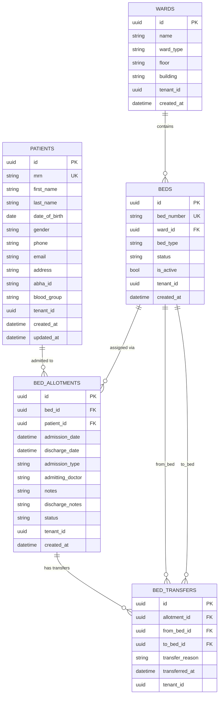

# 🏥 CareSphere — Hospital Management System

CareSphere is a modern, web-based **Hospital Management System (HMS)** built with **Blazor Server** and **.NET 10**. It streamlines core hospital operations including patient registration, bed/ward administration, patient admission & discharge workflows, and real-time bed occupancy tracking — all through an interactive, server-rendered UI.

---

## 📑 Table of Contents

- [About the Project](#about-the-project)
- [Technology Stack](#technology-stack)
- [Project Architecture](#project-architecture)
- [Modules & Readiness Status](#modules--readiness-status)
- [Database Schema](#database-schema)
- [Getting Started](#getting-started)
- [Project Structure](#project-structure)

---

## About the Project

CareSphere aims to digitize and simplify hospital management workflows. The system currently focuses on **patient registration** and **bed management** — two foundational modules that hospitals rely on daily. The application is designed with multi-tenancy in mind (via `TenantId` fields) and follows a clean service-oriented architecture with EF Core Code-First migrations.

---

## Technology Stack

| Layer            | Technology                                      |
| ---------------- | ----------------------------------------------- |
| **Framework**    | .NET 10 (ASP.NET Core)                          |
| **UI**           | Blazor Server (Interactive Server Render Mode)   |
| **Styling**      | Bootstrap 5 + Bootstrap Icons                   |
| **ORM**          | Entity Framework Core 9.0                       |
| **Database**     | PostgreSQL (hosted on Supabase)                  |
| **DB Provider**  | Npgsql (EF Core PostgreSQL Provider) 9.0         |
| **Architecture** | Service Layer Pattern (Interface + Implementation) |
| **IDE**          | Visual Studio 2022+                             |

---

## Project Architecture

```
┌──────────────────────────────────────────────┐
│              Blazor Server UI                │
│         (Razor Components / Pages)           │
├──────────────────────────────────────────────┤
│             Service Layer                    │
│   IPatientService / IBedService              │
│   PatientService  / BedService               │
├──────────────────────────────────────────────┤
│          Entity Framework Core               │
│         ApplicationDbContext                 │
├──────────────────────────────────────────────┤
│        PostgreSQL (Supabase)                 │
└──────────────────────────────────────────────┘
```

---

## Modules & Readiness Status

### ✅ Fully Implemented Modules

#### 1. Patient Management Module

> **Status: ✅ Complete**

Full CRUD operations for hospital patient records.

| Feature                     | Status |
| --------------------------- | ------ |
| Patient Registration        | ✅     |
| Patient List with Search    | ✅     |
| View Patient Details        | ✅     |
| Edit Patient Information    | ✅     |
| Delete Patient              | ✅     |
| Auto-generated MRN          | ✅     |
| Input Validation            | ✅     |
| Patient Count (Dashboard)   | ✅     |

**Key Fields:** MRN (auto-generated), First Name, Last Name, Date of Birth, Gender, Phone, Email, Address, ABHA ID, Blood Group

**Pages:**
- `/patients` — Patient listing with search
- `/patients/create` — New patient registration form
- `/patients/{id}` — View patient details
- `/patients/edit/{id}` — Edit patient record

---

#### 2. Ward Management Module

> **Status: ✅ Complete**

Master data management for hospital wards.

| Feature                        | Status |
| ------------------------------ | ------ |
| Create Ward                    | ✅     |
| Ward List                      | ✅     |
| Edit Ward                      | ✅     |
| Delete Ward (with validation)  | ✅     |
| Ward Types (General, ICU, Emergency, Private, Semi-Private) | ✅ |

**Business Rules:**
- A ward cannot be deleted if it has beds assigned to it.

**Pages:**
- `/wards` — Ward listing
- `/wards/create` — Create new ward
- `/wards/edit/{id}` — Edit ward details

---

#### 3. Bed Management Module

> **Status: ✅ Complete**

Master data management for hospital beds with ward association.

| Feature                        | Status |
| ------------------------------ | ------ |
| Create Bed                     | ✅     |
| Bed List (with filters)        | ✅     |
| Edit Bed                       | ✅     |
| Delete Bed (with validation)   | ✅     |
| Filter by Ward                 | ✅     |
| Filter by Status               | ✅     |
| Bed Types (Standard, ICU, Isolation, Pediatric) | ✅ |
| Status Tracking (Available, Occupied, Maintenance, Reserved) | ✅ |

**Business Rules:**
- A bed cannot be deleted if it has an active patient allotment.

**Pages:**
- `/beds` — Bed listing with ward/status filters
- `/beds/create` — Create new bed
- `/beds/edit/{id}` — Edit bed details

---

#### 4. Bed Allotment & Admission Module

> **Status: ✅ Complete**

Patient admission, discharge, and transfer workflows.

| Feature                        | Status |
| ------------------------------ | ------ |
| Admit Patient to Bed           | ✅     |
| View All Allotments            | ✅     |
| Discharge Patient              | ✅     |
| Transfer Patient Between Beds  | ✅     |
| Transfer History Tracking      | ✅     |
| Admission Types (OPD, IPD, Emergency) | ✅ |

**Business Rules:**
- A patient can only have **one active allotment** at a time.
- Only beds with status `Available` can be allotted.
- On admission → bed status changes to `Occupied`.
- On discharge → allotment status changes to `Discharged`, bed status changes to `Available`.
- On transfer → old allotment marked `Transferred`, new allotment created as `Active`, bed statuses updated accordingly.

**Pages:**
- `/allotments` — Allotment listing
- `/allotments/create` — Admit a patient
- `/allotments/transfer/{id}` — Transfer a patient to a different bed

---

#### 5. Bed Dashboard Module

> **Status: ✅ Complete**

Real-time overview of hospital bed occupancy.

| Feature                        | Status |
| ------------------------------ | ------ |
| KPI Cards (Total, Available, Occupied, Maintenance) | ✅ |
| Ward-wise Occupancy Breakdown  | ✅     |
| Occupancy Progress Bars        | ✅     |
| Color-coded Alerts (>75%, >90%) | ✅    |
| Quick Navigation Links         | ✅     |

**Pages:**
- `/beds/dashboard` — Bed occupancy dashboard

---

#### 6. Home Dashboard

> **Status: ✅ Complete (Partial Data)**

Main landing page with summary KPI cards.

| Feature                        | Status |
| ------------------------------ | ------ |
| Total Patient Count (live)     | ✅     |
| Available Beds Placeholder     | 🔲     |
| Today's Appointments Placeholder | 🔲   |

---

### 🔲 Planned / Not Yet Implemented

| Module                    | Status       |
| ------------------------- | ------------ |
| Appointment Scheduling    | 🔲 Not Started |
| Doctor Management         | 🔲 Not Started |
| Billing & Invoicing       | 🔲 Not Started |
| Lab / Diagnostics         | 🔲 Not Started |
| Pharmacy Management       | 🔲 Not Started |
| User Authentication & RBAC| 🔲 Not Started |
| Reporting & Analytics     | 🔲 Not Started |
| Multi-Tenant Administration | 🔲 Not Started |

---

## Database Schema



---

## Getting Started

### Prerequisites

- [.NET 10 SDK](https://dotnet.microsoft.com/download)
- [PostgreSQL](https://www.postgresql.org/) (or a Supabase account)
- Visual Studio 2022+ / VS Code

### Setup

1. **Clone the repository**
   ```bash
   git clone https://github.com/YashS3011/CareSphere.git
   cd CareSphere
   ```

2. **Configure the database connection**

   Update `appsettings.json` with your PostgreSQL connection string:
   ```json
   {
     "ConnectionStrings": {
       "DefaultConnection": "User Id=<user>;Password=<password>;Server=<host>;Port=5432;Database=<database>"
     }
   }
   ```

3. **Apply database migrations**
   ```bash
   dotnet ef database update
   ```

4. **Run the application**
   ```bash
   dotnet run
   ```

5. Open your browser and navigate to `https://localhost:5001` (or the port shown in the terminal).

---

## Project Structure

```
CareSphere/
├── Components/
│   ├── App.razor                  # Root application component
│   ├── Routes.razor               # Route configuration
│   ├── _Imports.razor             # Global using directives
│   ├── Layout/
│   │   ├── MainLayout.razor       # Main application layout
│   │   └── NavMenu.razor          # Sidebar navigation menu
│   └── Pages/
│       ├── Home.razor             # Dashboard landing page
│       ├── Patients/              # Patient CRUD pages
│       │   ├── List.razor
│       │   ├── Create.razor
│       │   ├── View.razor
│       │   └── Edit.razor
│       ├── Wards/                 # Ward master pages
│       │   ├── List.razor
│       │   ├── Create.razor
│       │   └── Edit.razor
│       ├── Beds/                  # Bed master pages + dashboard
│       │   ├── Dashboard.razor
│       │   ├── List.razor
│       │   ├── Create.razor
│       │   └── Edit.razor
│       └── Allotments/            # Admission/Discharge/Transfer pages
│           ├── List.razor
│           ├── Create.razor
│           └── Transfer.razor
├── Data/
│   └── ApplicationDbContext.cs    # EF Core DbContext
├── Models/
│   ├── Patient.cs
│   ├── Ward.cs
│   ├── Bed.cs
│   ├── BedAllotment.cs
│   ├── BedTransfer.cs
│   └── BedDashboardStats.cs
├── Services/
│   ├── IPatientService.cs         # Patient service interface
│   ├── PatientService.cs          # Patient service implementation
│   ├── IBedService.cs             # Bed/Ward/Allotment service interface
│   └── BedService.cs              # Bed/Ward/Allotment service implementation
├── Migrations/                    # EF Core migration files
├── wwwroot/                       # Static assets (CSS, favicon)
├── Program.cs                     # Application entry point & DI setup
├── appsettings.json               # Configuration
└── CareSphere.csproj              # Project file
```

---

## 📄 License

This project is for educational and portfolio purposes.

---

> **CareSphere** — Simplifying Hospital Management, One Module at a Time. 🏥
